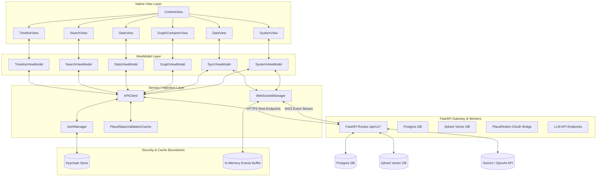
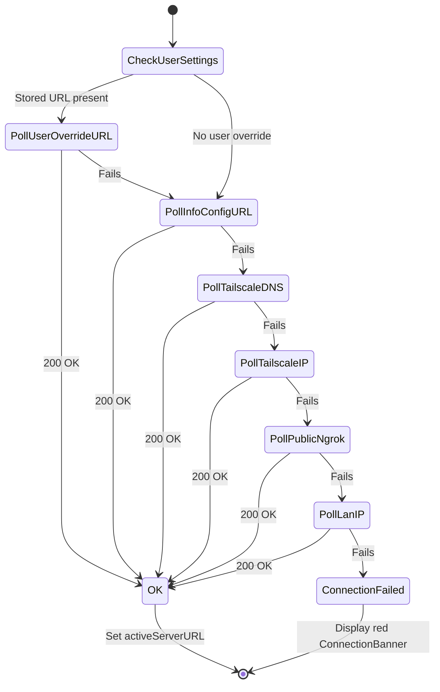

# Architecture Specification: PlaudBlenderiOS

## 1. Architectural Thesis

**PlaudBlenderiOS** (Chronos Mobile) is designed around a **Modular, Client-Server Hybrid Architectural Model**. Rather than attempting to run a local embedding model, Postgres instance, or Qdrant vector index directly on-device (which would strain iOS thermal and battery footprints), the app delegates computation-heavy AI processing to a self-hosted **FastAPI backend** while acting as an **observable cockpit** on the user's mobile device.

To maintain an exceptional user experience, the client is structured as a **native SwiftUI app with isolated, cached ViewModels (`@Observable`)**, a **robust connection fallback engine (`APIClient`)**, and a **real-time WebSocket telemetry ingestion system (`WebSocketManager`)**. 

---

## 2. High-Level Diagram



---

## 3. Layer-by-Layer Breakdown

### 1. View Layer (SwiftUI)
- **Responsibility**: Declares layout trees and binds UI elements to observable VM state.
- **Pattern**: Completely reactive. Uses the standard `.task` modifier for life-cycle actions, and limits layout logic by moving format operations to `Extensions/Date+Formatting.swift` and `Components/*`.
- **Key Files**: 
  - [ContentView.swift](PlaudBlenderiOS/ContentView.swift): Tab-bar and global banner presentation coordinator.
  - [GraphContainerView.swift](PlaudBlenderiOS/Views/Graph/GraphContainerView.swift): Bridges Cytoscape.js files within a WKWebView wrapper.

### 2. ViewModel Layer (`@Observable`)
- **Responsibility**: Holds UI state variables, triggers network requests via `APIClient`, and aggregates data structures for UI consumption.
- **Pattern**: ViewModels are class-based and annotated with `@Observable` (available in iOS 17+).
- **Key Files**:
  - [SyncViewModel.swift](PlaudBlenderiOS/ViewModels/SyncViewModel.swift): Holds status indicators, backing database records, and pipeline workflow telemetry.
  - [TimelineViewModel.swift](PlaudBlenderiOS/ViewModels/TimelineViewModel.swift): Manages expandable calendar maps and daily recordings feeds.

### 3. Service Layer (Networking & Cryptography)
- **Responsibility**: Translates logic operations to REST and WebSocket requests, manages auth keys, and caches health responses.
- **Pattern**: Decoupled singleton-like services instantiated in the App structure and passed through environment injection.
- **Key Files**:
  - [APIClient.swift](PlaudBlenderiOS/Services/APIClient.swift): Concrete implementation of network routing, ngrok-bypass headers, and versioned paths.
  - [AuthManager.swift](PlaudBlenderiOS/Services/AuthManager.swift): Resolves target backend host URLs dynamically and loads tokens from Keychain.
  - [KeychainService.swift](PlaudBlenderiOS/Services/KeychainService.swift): Low-level Wrapper around iOS Keychain API.

---

## 4. State Management Model

To prevent SwiftUI from triggering recursive view evaluation passes (which trigger "modifying state during view update" runtime warnings and crashes), PlaudBlenderiOS uses a **decoupled ViewModel lifecycle cache** managed in ContentView:

```swift
private final class ViewModelCache {
    private var _timeline: TimelineViewModel?
    private var _search: SearchViewModel?
    // Other view models...

    func timeline(api: APIClient) -> TimelineViewModel {
        if let vm = _timeline { return vm }
        let vm = TimelineViewModel(api: api)
        _timeline = vm
        return vm
    }
}
```

Since `ViewModelCache` is a plain Swift class (not `@Observable`), mutating its internal cached references does not trigger SwiftUI state re-evaluations.

---

## 5. Server Connection Bootstrapping State Machine

APIClient polls multiple network routes on startup to establish the fastest possible connectivity route. The resolution priorities are mapped as follows:



---

## 6. Data Model Overview

Data entities maps 1:1 with Chronos FastAPI Pydantic schema contracts:

```
                  ┌───────────────────────┐
                  │      DaySummary       │
                  │                       │
                  │ - date: String        │
                  │ - totalDuration: Int  │
                  └──────────┬────────────┘
                             │ (1:N)
                             ▼
                  ┌───────────────────────┐
                  │   ChronosRecording    │
                  │                       │
                  │ - id: String          │
                  │ - title: String       │
                  │ - duration: Float     │
                  └──────────┬────────────┘
                             │ (1:N)
                             ▼
                  ┌───────────────────────┐
                  │     ChronosEvent      │
                  │                       │
                  │ - id: String          │
                  │ - category: String    │
                  │ - content: String     │
                  │ - similarity: Float   │
                  └───────────────────────┘
```

- **DaySummary**: Grouping structure containing a calendar mapping and aggregated timeline blocks.
- **ChronosRecording**: Full representation of a voice recording session (contains title, transcription reference, and raw WAV URL).
- **ChronosEvent**: Granular event nodes extracted by AI from voice segments. These nodes form the coordinates inside Cytoscape.js diagrams.

---

## 7. Service Boundary Map

```
┌─────────────────────────────────────────────────────────────────┐
│                    iOS App Sandbox Boundary                     │
│                                                                 │
│   ┌───────────────┐        ┌───────────────┐                    │
│   │   Keychain    │        │  URLCache     │                    │
│   │  (API Token)  │        │ (Audio Files) │                    │
│   └───────┬───────┘        └───────┬───────┘                    │
│           │                        │                            │
│           ▼                        ▼                            │
│     ┌────────────────────────────────────┐                      │
│     │            APIClient               │                      │
│     └─────────────────┬──────────────────┘                      │
└───────────────────────┼─────────────────────────────────────────┘
                        │ HTTPS / WSS
                        ▼
┌─────────────────────────────────────────────────────────────────┐
│                    Cloud Server Network Boundary                │
│                                                                 │
│     ┌────────────────────────────────────┐                      │
│     │        FastAPI REST Server         │                      │
│     └─────────────────┬──────────────────┘                      │
│                       │                                         │
│        ┌──────────────┴──────────────┐                          │
│        ▼                             ▼                          │
│   ┌───────────┐                 ┌───────────┐                   │
│   │ Postgres  │                 │  Qdrant   │                   │
│   │ (Metrics) │                 │  Vectors  │                   │
│   └───────────┘                 └───────────┘                   │
└─────────────────────────────────────────────────────────────────┘
```

---

## 8. Concurrency Model

1. **Swift Async/Await**: Network actions, file downloads, and database updates use native `async` tasks.
2. **Actor Constraints**: UI updates are bound to the `@MainActor` thread. ViewModels use `@MainActor` class decorators.
3. **Structured Task Lifetime**: Tasks spawned by view controllers (e.g., polling server metrics or WebSocket ingestion loops) are bound to Swift's `.task { ... }` blocks to ensure execution frames automatically cancel when the view collapses.

---

## 9. Error Handling Model

API actions map responses using `APIError`:
- `.invalidURL`: The backend target path string is malformed.
- `.invalidResponse`: The server returned an empty body or non-HTTP payload.
- `.httpError(status, body)`: The server returned an error code.
- `.decodingFailed`: JSON structures failed parsing checks.
- `.unauthorized`: Token credentials expired or failed validation checks.

Timeout errors in `APIClient` are caught and retried up to two times with delays of 0.4s and 1.0s.

---

## 10. Logging and Observability Model

- **OSLog Subsystems**: Logging outputs are channeled into `com.gunndamental.PlaudBlenderiOS` logs with dedicated category markers (`App`, `APIClient`, `WebSocket`, `Auth`).
- **X-Ray Event Log**: Network payloads are formatted into `ClientNetworkEvent` structs and appended to a telemetry list (`networkEvents`) with request bytes, response sizes, execution timings, and headers.
- **Header Masking**: Security filters inside `APIClient.sanitizedHeaders(from:)` redact headers like `Authorization` and `X-API-Key` to avoid leakage inside local logs.

---

## 11. Known Architectural Tradeoffs

1. **WebView-based Graph Rendering**: Renders Cytoscape.js within a WKWebView instead of a native SwiftUI Canvas.
   - *Rationale*: Reuses layout math (cose, grid) and mouse scripts from the desktop dashboard.
   - *Tradeoff*: Introduces Javascript bridging complexity and increases memory usage.
2. **Telemetry Ingestion over WebSocket**: Swaps REST polling for a WSS framework.
   - *Rationale*: Reduces REST traffic and latency overhead.
   - *Tradeoff*: Increases connection monitoring demands.

---

## 12. Extension Points

- **SwiftData Storage**: Can be introduced by replacing `CacheManager` methods with persistent SwiftData entity declarations to enable offline timeline checks.
- **APNs Remote Background Sync**: An APNs handler can hook into `PlaudBlenderiOSApp.swift` to wake the client when the backend finishes processing voice recordings.
