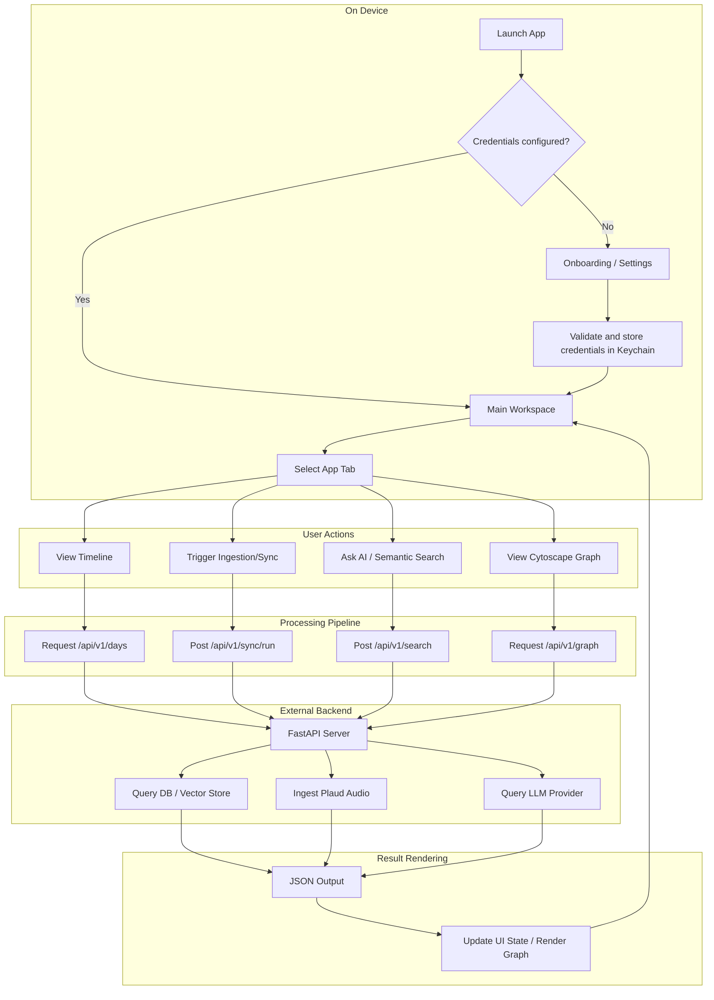
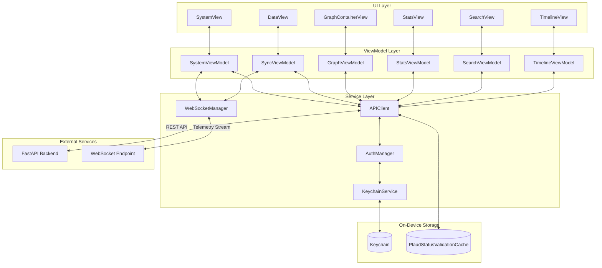
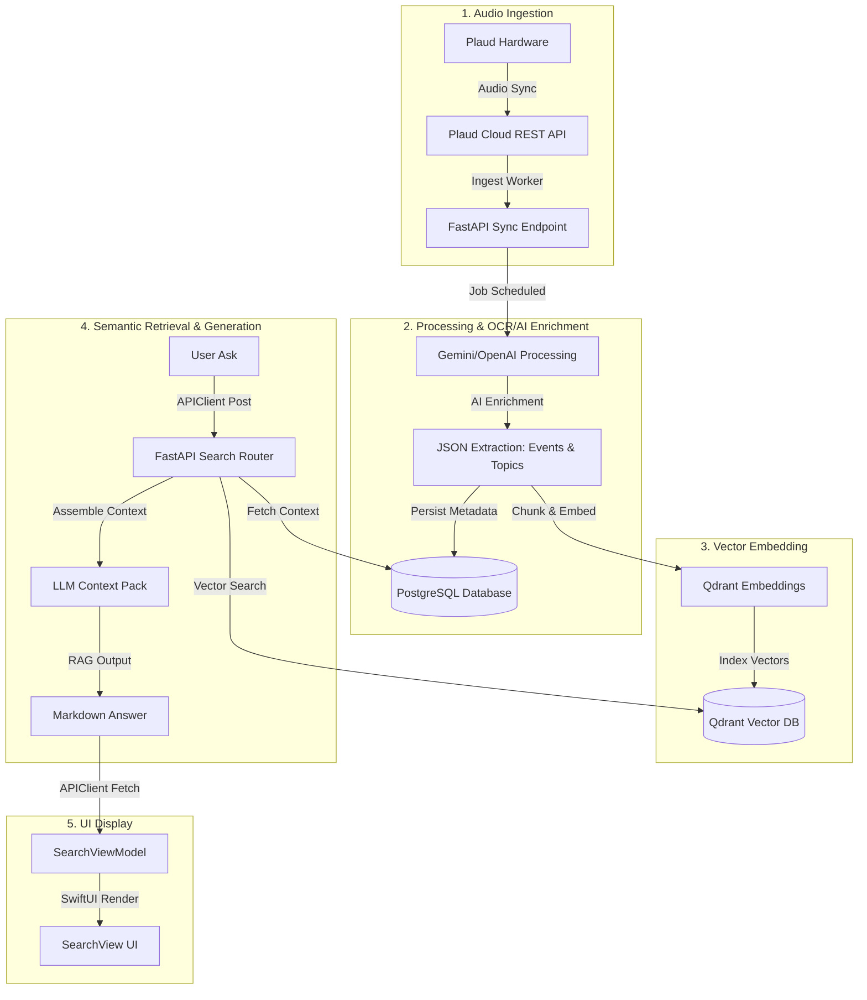
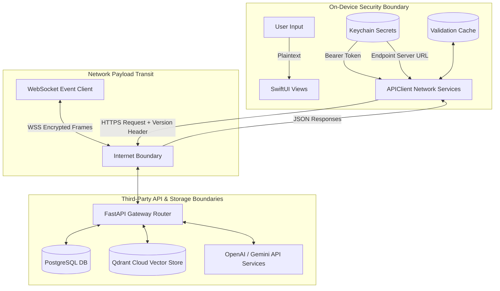

# PlaudBlenderiOS

<p align="center">
  <strong>Native SwiftUI client for Chronos — a multi-modal AI knowledge timeline and vector graph built from Plaud voice recordings.</strong>
</p>

<p align="center">
  
  
  
  
</p>

## Overview

**PlaudBlenderiOS** (Chronos Mobile) is a native iOS/macOS client designed to act as the primary interface for **Chronos**, a knowledge collection pipeline. Chronos translates hours of continuous ambient voice recordings (captured via Plaud hardware) into structured, queryable data nodes, timeline logs, cost tracking stats, and Cytoscape-powered connection graphs.

Unlike consumer AI companion apps that hide operational mechanics behind simple chat interfaces, PlaudBlenderiOS is built for granular, developer-first observability. It features a live WebSocket telemetry viewer (X-Ray), pipeline controls to trigger backend steps (ingest, process, index, graph), detailed API usage metrics, and multi-endpoint server routing that gracefully resolves connection channels.

---

## Product Snapshot

| Dimension | Detail |
|---|---|
| **Platform** | iOS 26.2+ / macOS Catalyst / iPadOS |
| **Language** | Swift (Async/Await Concurrency) |
| **UI Framework**| SwiftUI (Native) + WebKit (Cytoscape.js Bridge) |
| **Architecture**| MVVM-S with `@Observable` macro state control |
| **Primary APIs** | Chronos FastAPI Backend, Plaud REST API, Notion API, Gemini API, OpenAI API |
| **Storage** | Keychain Services (Auth & Server Tokens) |
| **Status** | Shipped / Active development |
| **App Store** | Not published (Enterprise/Self-hosted distribution) |
| **License** | MIT |

---

## What This App Demonstrates

- **Multi-Endpoint Network Fallback Probing**: A robust server bootstrapping process in `APIClient` that sequentially polls custom Setting overrides, Tailscale MagicDNS, stable Tailscale IPs, ngrok tunnels, and home LAN IPs to ensure offline/online transitioning without user intervention.
- **Hybrid JS Graph Visualization**: Low-overhead WKWebView integration using Cytoscape.js to render highly complex entity-relationship graphs on mobile, utilizing custom JavaScript stylesheets and Swift-to-JS bridge messages.
- **WebSocket-Based Telemetry Ingestion**: Real-time event logging via `WebSocketManager` which consumes an active backend JSON event loop, populating a local X-Ray telemetry view with millisecond latency timings.
- **Observed State Isolation**: Decoupled View-ViewModel management using a custom `ViewModelCache` in the root coordinator to avoid SwiftUI's "modifying state during view update" runtime crashes.
- **API Cost Observation**: Seamless integration with the backend cost tracking schemas to render interactive Swift Charts showing model token expenses and session resource distributions.
- **Secure Key/Token Boundary**: Strict usage of Apple Keychain Services for storing the Chronos auth credentials and endpoint configurations rather than plaintext UserDefaults.

---

## End-to-End User Journey



---

## System Architecture



---

## Core Pipeline



---

## Data Flow



---

## Ingestion / Processing / Retrieval Details

### Ingestion
Chronos ingests audio files through two paths:
1. **Automatic Plaud Cloud Sync**: Retrieves structural WAV/MP3 files directly from the Plaud Server using Plaud Client OAuth credentials.
2. **Local Device File Uploads**: Upload candidates can be queued directly via the **Data** tab (`DataView`) using `multipart/form-data` uploads routed to `/api/v1/sync/upload/process`.

### Processing
Ingested files undergo transcript processing, summarization, and key-event mapping. The backend queues tasks into `chronos_processing_jobs` tables. The processing engine segments transcripts, runs Gemini audio-enrichment templates, and outputs structured entity nodes.

### Retrieval / Querying
The **Search** interface executes semantic search queries by mapping query strings to embeddings on the server and searching Qdrant vector databases. Results are filtered by category pills (e.g., *work*, *health*, *finance*, *ideas*) and displayed with corresponding similarity confidence badges.

### Generation / Output
Users can toggle the **Ask AI** prompt panel. Chronos packs vector search contexts into structured GPT-4o/5.4 system messages. The response outputs as streaming markdown text, complete with recording source timeline references.

---

## Key Technical Decisions

| Decision | Rationale | Tradeoff |
|---|---|---|
| **Apple Keychain for Tokens** | Protects API tokens and custom URLs from device-level sandbox extracts. | Requires manual configuration step on launch. |
| **WKWebView Cytoscape Bridge** | Reuses web graph styles, concentric/grid layout math, and mouse-hover scripts from the desktop dashboard. | WebKit processes add thread context limits and memory overhead. |
| **Multi-endpoint Probing** | Gracefully iterates Tailscale dns, LAN, and ngrok endpoints. | Initial connect attempt can block UI tasks for up to 1.5s if timeouts occur. |
| **Plain Cache ViewModel Allocation** | Holds VMs in a plain Swift cache class (`ViewModelCache`) rather than inside view init structs. | Requires clean environment setups. |
| **ngrok Browser Bypass Headers** | Injects custom request headers (`ngrok-skip-browser-warning`) into all URLSession queries. | Tightly binds request logic to ngrok infrastructure constraints. |
| **Persistent WS for Telemetry** | Swaps polling loops for push telemetry frames to capture rapid diagnostic updates. | Demands complex auto-reconnect workflows when socket loses packets. |

---

## File Entry Points

| Concern | Files | Responsibility |
|---|---|---|
| **App Entry** | [PlaudBlenderiOSApp.swift](PlaudBlenderiOS/PlaudBlenderiOSApp.swift) | Bootstrapping core environments and checking server state |
| **Main UI shell** | [ContentView.swift](PlaudBlenderiOS/ContentView.swift) | Coordinating tab selectors and error banner overlays |
| **Network Engine** | [APIClient.swift](PlaudBlenderiOS/Services/APIClient.swift) | HTTP client mapping, fallback route probing, and retry scheduling |
| **WebSocket** | [WebSocketManager.swift](PlaudBlenderiOS/Services/WebSocketManager.swift) | WSS frame mapping and real-time telemetry processing |
| **Credentials** | [AuthManager.swift](PlaudBlenderiOS/Services/AuthManager.swift) | Loading host targets and fetching Keychain secrets |
| **Ingestion Control** | [SyncViewModel.swift](PlaudBlenderiOS/ViewModels/SyncViewModel.swift) | Directing pipeline execution steps, backups, and file candidate uploads |
| **Diagnostics UI** | [SystemView.swift](PlaudBlenderiOS/Views/System/SystemView.swift) | Displaying health check charts and live database metrics |

---

## Configuration

The application reads options from both compile-time configurations (Info.plist) and runtime overrides stored securely in the Keychain.

| Setting | Storage | Default | Required | Purpose |
|---|---|---:|---:|---|
| `ChronosServerURL` | `Info.plist` / Keychain | `https://your-ngrok-domain.ngrok-free.dev` | Yes | Target host for the FastAPI endpoints |
| `chronos_api_key` | Keychain | *None* | Yes | API authentication token injected in Bearer headers |
| `PlaudSyncNotices` | Memory | *None* | No | Dynamic warnings derived from pipeline health diagnostics |

---

## Getting Started

### Prerequisites
- macOS Sequoia (or newer)
- Xcode 26.3+
- iOS 26.2+ Device or Simulator
- Running [Chronos API Backend](https://github.com/Gunnarguy/PlaudBlender)

### Setup Steps
1. Clone the repository:
   ```bash
   git clone https://github.com/Gunnarguy/PlaudBlenderiOS.git
   cd PlaudBlenderiOS
   ```
2. Open the Xcode Project:
   ```bash
   open PlaudBlenderiOS.xcodeproj
   ```
3. Configure the active schema. Select your destination simulator or device.
4. Set up authentication. Enter Settings in the iOS interface and supply your Chronos API token and server URL.

---

## Testing and QA

| Validation | Command / Procedure | Expected Result |
|---|---|---|
| **Build Target** | Build (`⌘B`) in Xcode | Build succeeds without compilation failures |
| **Unit Tests** | Test (`⌘U`) in Xcode | All target assertions pass successfully |
| **Manual Connection QA** | Force-close Wi-Fi to drop LAN connection | Client falls back automatically to ngrok tunnel and re-authenticates |

---

## Privacy and Security

- **Local Storage Restrictions**: All tokens and server target configurations are confined to Keychain Services. Plain text data caching is limited to transient memory scopes and cache validators.
- **Network Boundaries**: Outbound API commands are directed strictly to verified user-configured servers. Plaintext authentication keys are never leaked to logs or external telemetry streams.
- **Log Sanitation**: Diagnostics in [APIClient.swift](PlaudBlenderiOS/Services/APIClient.swift) automatically redact parameters like `authorization` and custom tokens before logging events.

For details, view [SECURITY.md](SECURITY.md) and [PRIVACY.md](PRIVACY.md).

---

## Documentation Index

| Document | Purpose |
|---|---|
| [README.md](README.md) | Main project layout, architecture flowcharts, and quickstart |
| [ARCHITECTURE.md](ARCHITECTURE.md) | In-depth Swift structural patterns, concurrency details, and design decisions |
| [ROADMAP.md](ROADMAP.md) | Milestones tracker, limitations, and future improvements |
| [SECURITY.md](SECURITY.md) | Security constraints, Keychain models, and log sanitization filters |
| [PRIVACY.md](PRIVACY.md) | User privacy details, API transmission boundaries, and storage safety |
| [APP_STORE.md](APP_STORE.md) | App Store review checklists and testing procedures |
| [docs/CASE_STUDY.md](docs/CASE_STUDY.md) | Engineering case study outlining challenges, outcomes, and future recommendations |
| [.github/copilot-instructions.md](.github/copilot-instructions.md) | Directives for automated coding assistants working on the iOS codebase |

---

## Roadmap

### Completed
- [x] Multi-endpoint server bootstrap connection fallback engine.
- [x] WebView-bridged Cytoscape.js knowledge graph display.
- [x] Interactive Swift Charts showing runtime metrics and API cost limits.
- [x] WebSocket-driven real-time X-Ray telemetry monitor.

### In Progress
- [ ] Polish of local files candidate scanner and upload routing details.
- [ ] Improving graph search filters inside the Cytoscape canvas view.

### Planned
- [ ] SwiftData persistent caching layer for offline timeline review.
- [ ] APNs remote notifications for background pipeline jobs execution alerts.

---

## License

This project is licensed under the MIT License - see the `LICENSE` file for details.
